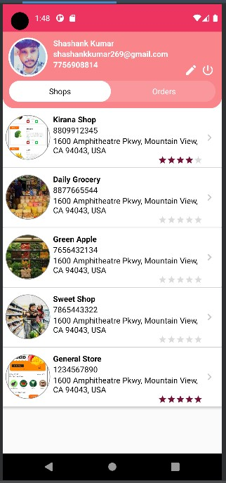
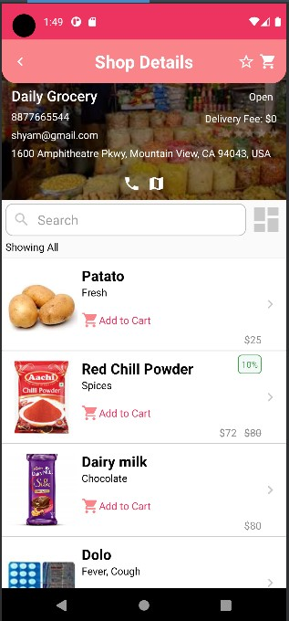
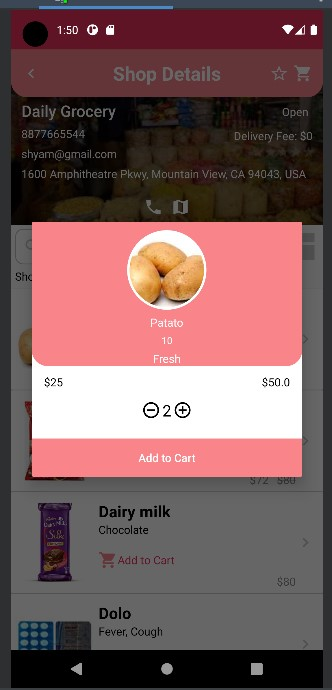
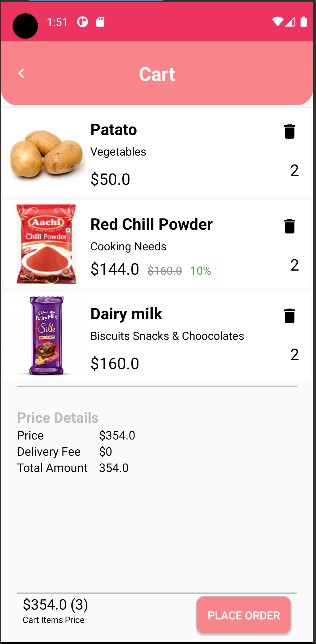
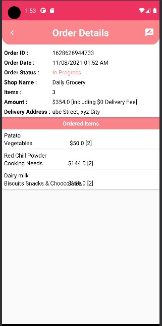
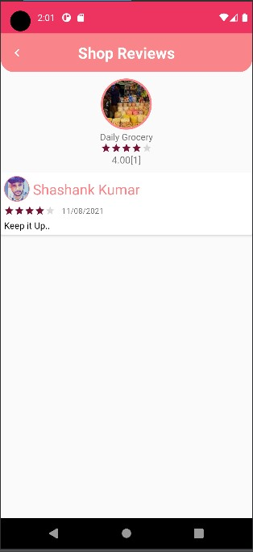
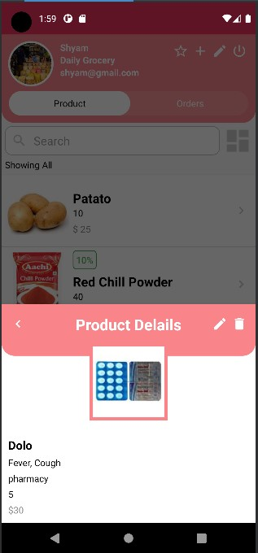
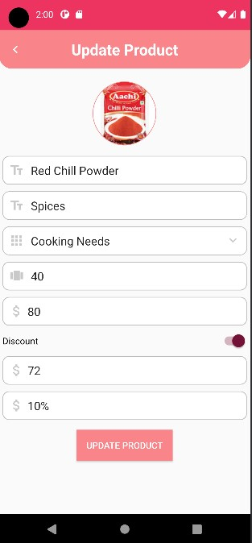
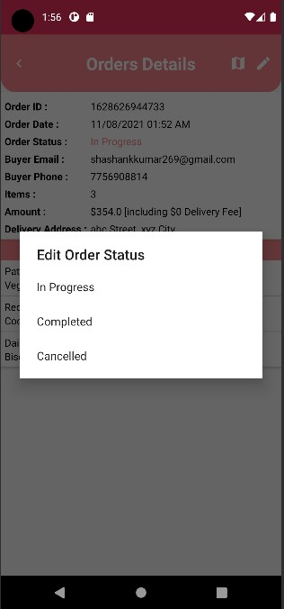

# GroceryApp
E-Grocery App in Android Studio Java
An android application for buying grocery online from near by shops, In it seller are also able to register their shop. 
## Technology/ Stack used :
- Java 
- XML
- firebase
- Android Studio

## Screenshots :camera:

|                        Shop List                     |                        Product List                   |                       Add-to-Cart                     |
| :--------------------------------------------------: | :---------------------------------------------------: | :---------------------------------------------------: |
|                   |                    |                  |

|                         Cart                         |                        Order Details                  |                      Shop Review                      |
| :--------------------------------------------------: | :---------------------------------------------------: | :---------------------------------------------------: |
|                    |                 |                  |

|                   Seller Product Details             |                Seller Add/Update products             |            Seller Edit-Confirmation                   |
| :--------------------------------------------------: | :---------------------------------------------------: | :---------------------------------------------------: |
|               |                     |       |

## APK :
[Apk link](https://drive.google.com/file/d/1l18Rs5QVvqe2qALZIIO-ACY7EGph_7_C/view?usp=sharing)

## Features :clipboard:
**Buyer-**  
&nbsp;&nbsp;&nbsp;&nbsp;&nbsp;1.Able to Registere 
&nbsp;&nbsp;&nbsp;&nbsp;&nbsp;2.Able to Login />
&nbsp;&nbsp;&nbsp;&nbsp;&nbsp;3.Able to view all the products available in store 
&nbsp;&nbsp;&nbsp;&nbsp;&nbsp;4.Manage list and add product to cart 
&nbsp;&nbsp;&nbsp;&nbsp;&nbsp;5.Know the status of orders 
&nbsp;&nbsp;&nbsp;&nbsp;&nbsp;6.Manage Orders 
&nbsp;&nbsp;&nbsp;&nbsp;&nbsp;7.Rate and review shops 
&nbsp;&nbsp;&nbsp;&nbsp;&nbsp;8.Search and sort procuct 
&nbsp;&nbsp;&nbsp;&nbsp;&nbsp;9.Watch open/close status of shop 
**Seller-**  
&nbsp;&nbsp;&nbsp;&nbsp;&nbsp;1.Able to Registere 
&nbsp;&nbsp;&nbsp;&nbsp;&nbsp;2.Able to Login />
&nbsp;&nbsp;&nbsp;&nbsp;&nbsp;3.Add, remove and modify procucts 
&nbsp;&nbsp;&nbsp;&nbsp;&nbsp;4.Easily change price of any product 
&nbsp;&nbsp;&nbsp;&nbsp;&nbsp;5.Set discount and offer tag to any procuct 
&nbsp;&nbsp;&nbsp;&nbsp;&nbsp;6.Search and sort procuct 
&nbsp;&nbsp;&nbsp;&nbsp;&nbsp;7.Manage Orders 
